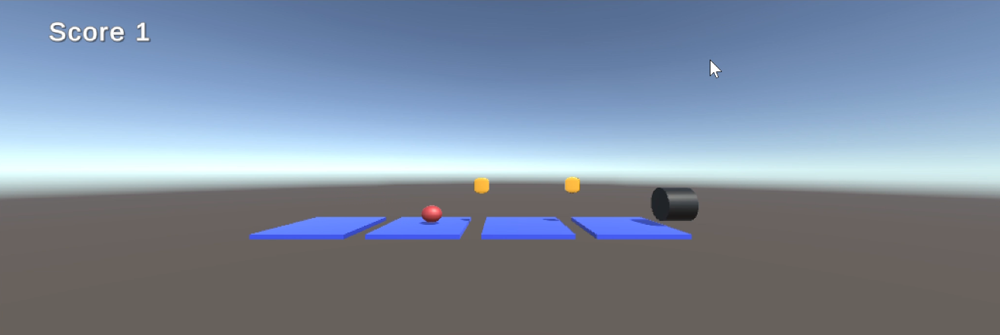
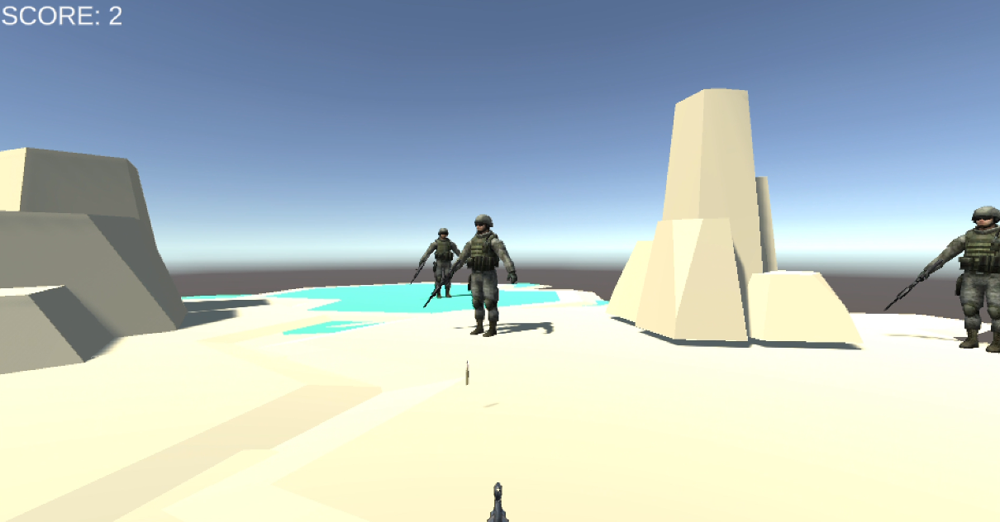
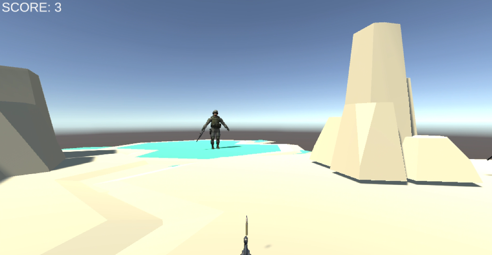
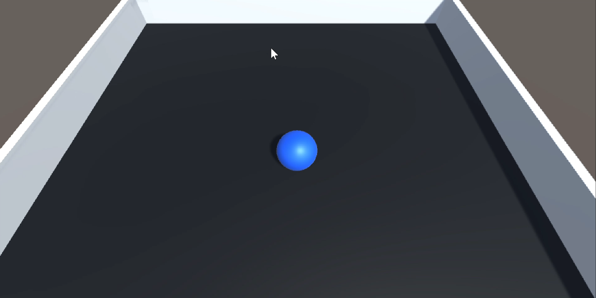
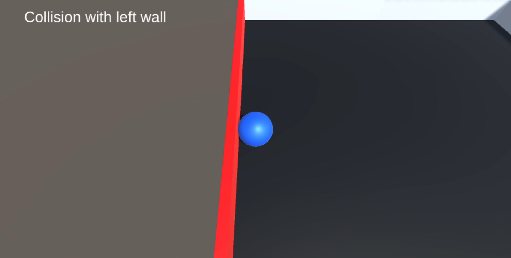
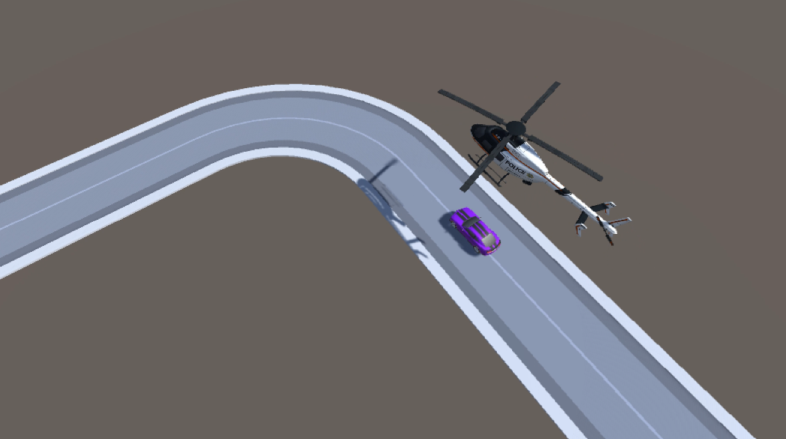
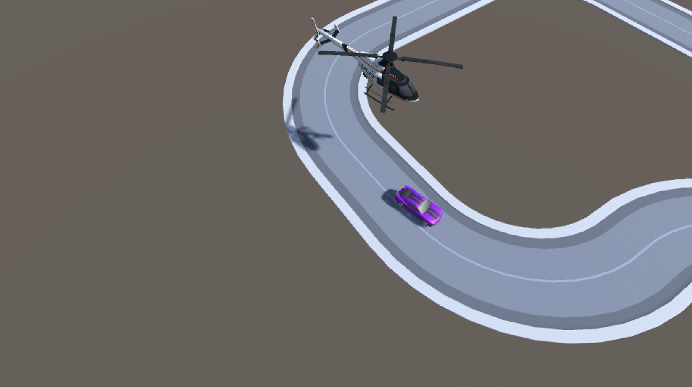

# ARVR Projects

1. Platformer
    - Platformer concept game in which a player controlled ball has to collect coins

2. Battlefield
    - First Person Shooter game where player can eliminate enemies increasing the score
    - Uses Unity terrain and Kenney asset packs.

3. Ball Balancing
    - A ball game where player has to balance a ball on a plate.
    - Player can control the plate tilt in order to move the ball and avoid collision with the walls.
    - Alert is emitted upon collision

4. Car driving
    - A car driving game where player has to outrun a helicopter following the car.

